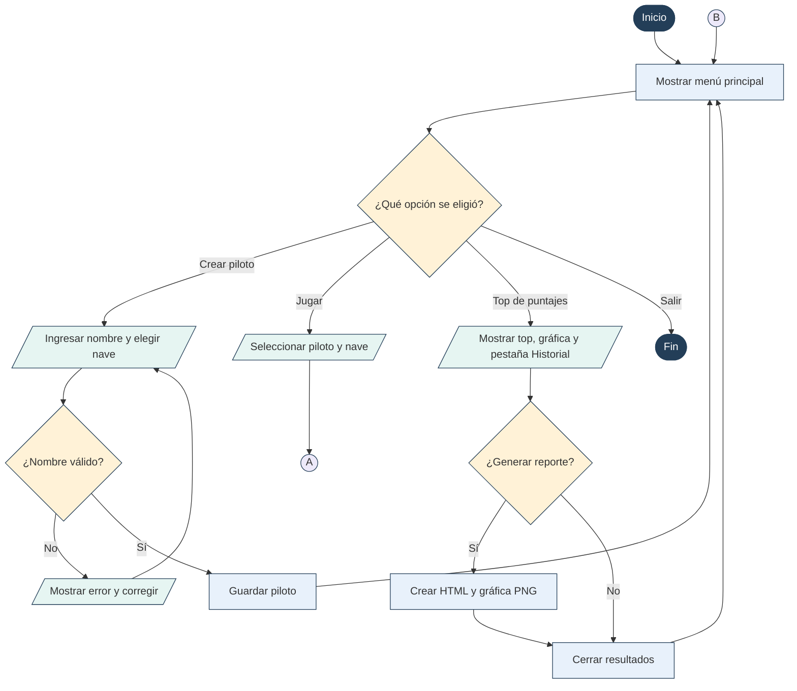
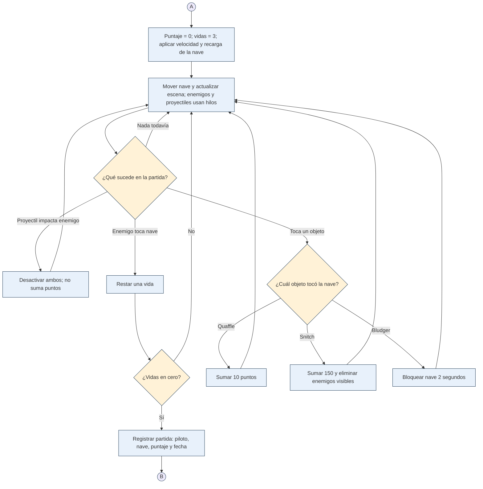

# Diagrama de flujo — Quetzal Space Defender

**Práctica 2 · IPC1**  
**Estudiante:** René Fuentes · **Carné:** 202501994

Los procesos principales están separados en dos diagramas para que se puedan leer. **A** lleva del menú a la partida y **B** devuelve al menú después de registrar el resultado. La partida termina al perder las **tres vidas**; no se usa un cronómetro de 60 segundos. El top se ordena por puntaje, mientras que el historial conserva el orden de las partidas.

## 1. Menú, pilotos y resultados

## 2. Partida y registro del resultado

**Figuras usadas:** óvalo = inicio o fin; rectángulo = proceso; paralelogramo = entrada o salida; rombo = decisión; círculo con letra = conexión entre las dos partes del diagrama. Cada respuesta de una decisión indica hacia dónde continúa el programa.

**Versión lista para imprimir:** [Diagrama de flujo en PDF](Diagrama_Flujo_Quetzal_Space_Defender.pdf).
