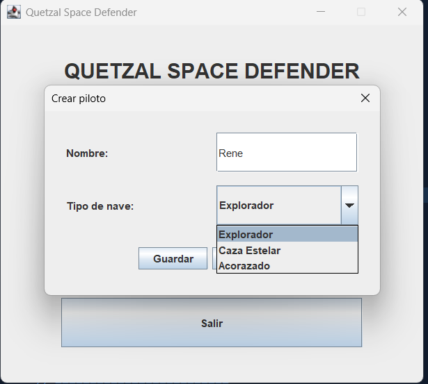
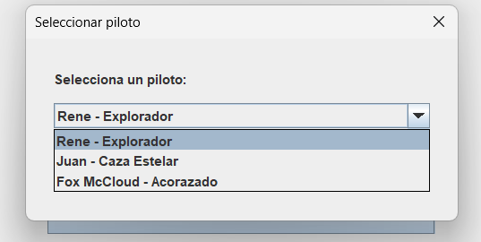
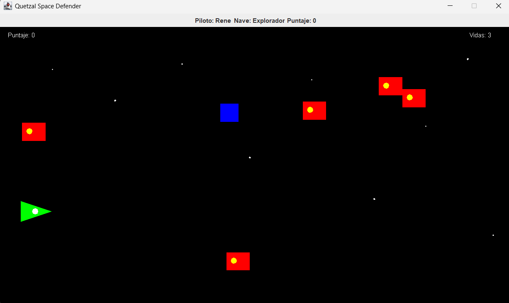
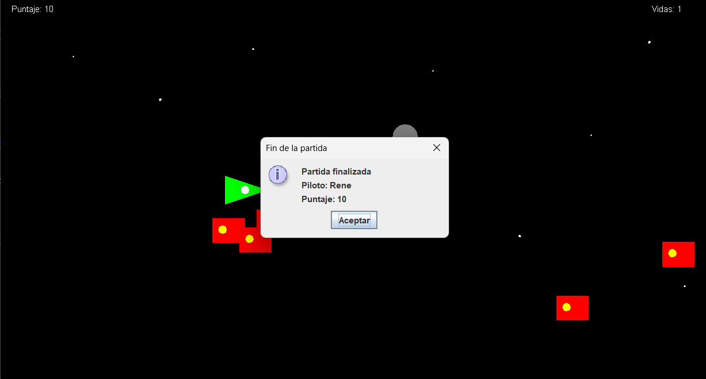
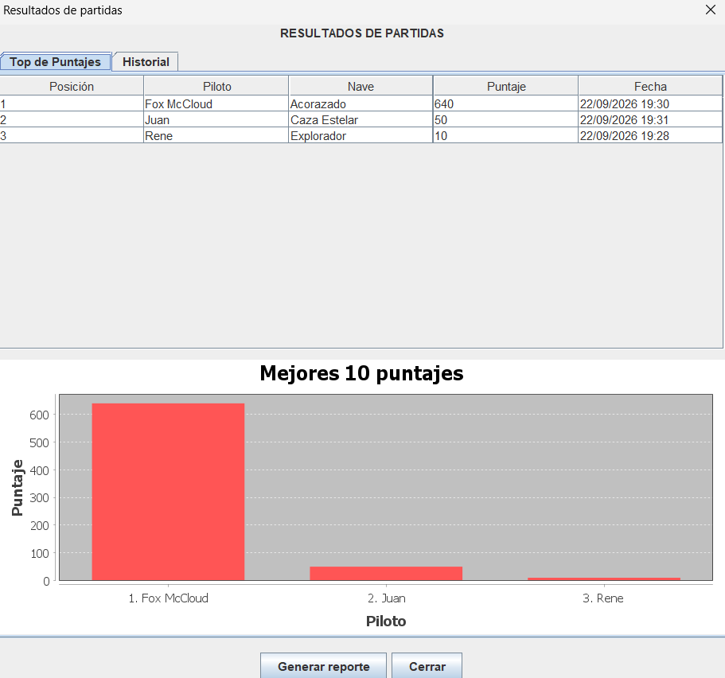
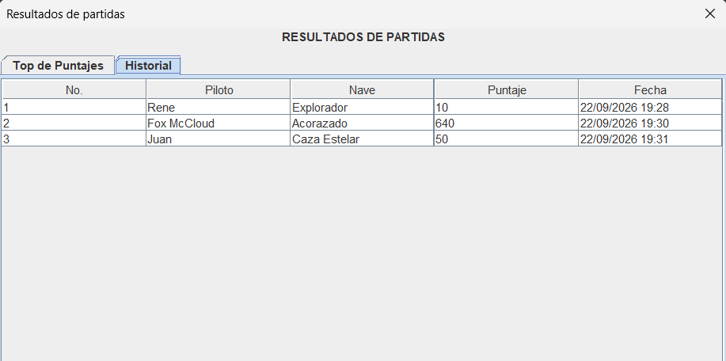
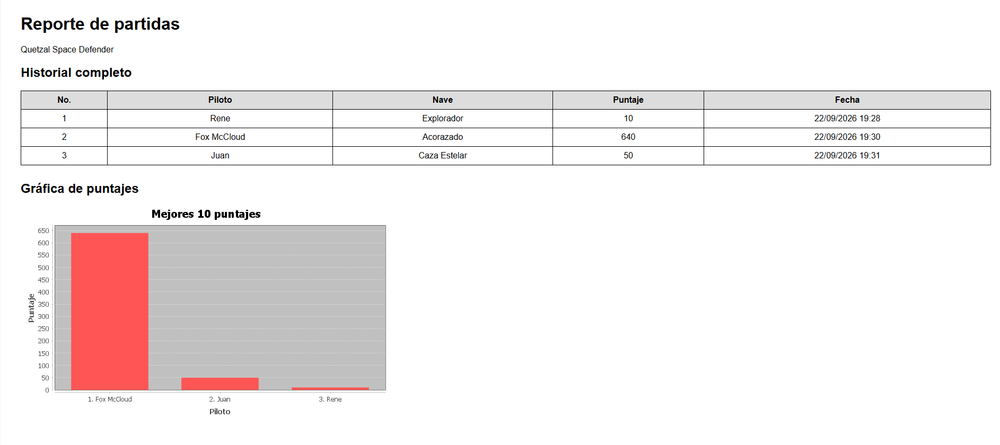

# Manual técnico — Quetzal Space Defender

**Práctica 2 · Introducción a la Programación y Computación 1**  
**Estudiante:** René Fuentes · **Carné:** 202501994

## 1. Propósito y alcance

Quetzal Space Defender es un juego de desplazamiento horizontal hecho en Java. Se registra un piloto con un tipo de nave, se juega hasta agotar tres vidas y el resultado se consulta en el top de puntajes, el historial o un reporte HTML. Este documento describe cómo se organizan esas partes y cómo se relacionan; las instrucciones para jugar están en el manual de usuario.

El programa aplica clases, arreglos, eventos de Swing e hilos independientes para enemigos y proyectiles. Los pilotos y las partidas permanecen en memoria durante la ejecución.

## 2. Herramientas y estructura del proyecto

| Herramienta | Uso en el programa |
| --- | --- |
| Java y Maven | Código, dependencia externa y construcción del proyecto |
| Swing y AWT | Menú, cuadros de diálogo, tablas, teclado y dibujo del juego |
| `Thread` | Movimiento independiente de cada enemigo y proyectil |
| `javax.swing.Timer` | Lectura continua de teclas y actualización del panel |
| JFreeChart | Gráfica de los mejores diez puntajes |
| `java.io` | Creación y escritura del reporte HTML |
| `ImageIO` | Archivo PNG de la gráfica del reporte |

La carpeta `Practica2` contiene `pom.xml` y `src/main/java/quetzal/`, donde se encuentran las clases Java. La dependencia de gráfica es `org.jfree:jfreechart:1.5.6`. El nivel de Java se configura en `maven.compiler.release`; durante el desarrollo se indicó Java 26.

Para ejecutar desde NetBeans se abre `Practica2` como proyecto Maven, se espera a que descarguen las dependencias y se utiliza **Run Project**. La clase principal indicada es `quetzal.Practica2`. En otro equipo se necesita un JDK compatible con el nivel configurado.

## 3. Organización de clases y datos

| Parte | Clases | Responsabilidad |
| --- | --- | --- |
| Pilotos | `Piloto`, `GestionPilotos` | Datos, validación y arreglo de pilotos |
| Navegación | `MenuPrincipal`, `VentanaCrearPiloto`, `VentanaSeleccionPiloto` | Registro y elección antes de jugar |
| Juego | `VentanaJuego`, `PanelJuego` | Ventana, dibujo, controles, puntaje, vidas y colisiones |
| Entidades | `Proyectil`, `Enemigo`, `ObjetoEspacial` | Posición, movimiento y efectos de los elementos |
| Resultados | `Partida`, `GestionPartidas`, `VentanaTopPuntajes` | Registro, ordenamiento, historial y gráfica |
| Salida | `GeneradorReporte` | Exportación del HTML y de la gráfica |

La clase de inicio crea los gestores y entrega las mismas instancias a las ventanas. Así, una partida terminada puede añadirse al gestor y aparecer en resultados sin duplicar el historial. Cada gestor lleva un arreglo y un contador de posiciones ocupadas.

## 4. Registro y selección de pilotos

`VentanaCrearPiloto` recoge el nombre y el modelo de nave. `GestionPilotos` comprueba si el nombre está vacío, ya existe o no queda espacio en el arreglo. Solo después de esas validaciones almacena un `Piloto`. Un cuadro de diálogo de Swing muestra el aviso de error.

`VentanaSeleccionPiloto` recorre los pilotos registrados y agrega al cuadro desplegable el nombre y la nave de cada uno. Al presionar **Comenzar**, pasa el piloto elegido a `VentanaJuego`, que muestra esos datos encima del área de juego.

| Modelo | Movimiento | Tiempo entre disparos |
| --- | --- | --- |
| Explorador | Rápido | 2 segundos |
| Caza Estelar | Medio | 1 segundo |
| Acorazado | Lento | 0.3 segundos |

## 5. Actualización de la partida

### Entrada de teclado y movimiento

`PanelJuego` guarda el estado de arriba, abajo, izquierda y derecha al presionar o soltar las teclas. Un `Timer` de Swing consulta esos estados aproximadamente cada 16 ms y modifica la posición de la nave. Los ejes se calculan por separado, de modo que dos teclas permiten avanzar en diagonal. Antes de dibujar se limita la posición al tamaño del panel.

La barra espaciadora intenta disparar una vez por pulsación. `disparar` revisa la recarga del modelo elegido antes de crear otro proyectil. Esto evita que mantener la tecla presionada produzca disparos sin respetar la espera.

### Enemigos, proyectiles y dibujo

Cada `Enemigo` aparece cerca del borde derecho y avanza hacia la izquierda en su propio hilo. Cada `Proyectil` avanza mediante otro hilo independiente. El panel dibuja las entidades activas y comprueba cuándo salen del área visible o chocan. Al tocarse un proyectil y un enemigo, ambos se desactivan. Si un enemigo alcanza la nave, se pierde una vida; hay un breve período de protección para evitar varios descuentos por el mismo contacto.

En esta pantalla se comprueba la salida de `VentanaJuego` y `PanelJuego`: piloto y nave arriba; puntaje y vidas sobre el escenario; enemigos a la derecha. La captura evidencia el estado visible; la lógica de movimiento se explica en los párrafos anteriores.

### Objetos especiales y fin de la partida

| Objeto | Efecto al tocar la nave |
| --- | --- |
| Quaffle (azul) | Suma 10 puntos |
| Snitch (amarillo) | Suma 150 puntos y elimina los enemigos visibles |
| Bludger (gris) | Bloquea el movimiento durante 2 segundos |

Los objetos aparecen desde la derecha. El Snitch tiene menor frecuencia de aparición. En esta implementación destruir enemigos no agrega puntos: la puntuación proviene de Quaffles y Snitches. Al llegar a cero vidas se detiene la partida y se crea un resultado con piloto, nave, puntaje y fecha.

El cuadro de fin permite cotejar el puntaje del juego con el que se informa al terminar. Ese resultado pasa a `GestionPartidas` para consultarlo después en las tablas.

## 6. Gestión de puntajes y visualización

`Partida` reúne los datos de cada juego finalizado. `GestionPartidas` agrega el resultado al arreglo en orden de registro. Para ordenar puntajes se trabaja con una copia, de modo que el historial conserva el orden en que se jugaron las partidas. La clasificación va de mayor a menor; la gráfica muestra como máximo los diez mejores.

`VentanaTopPuntajes` presenta la clasificación y el historial en pestañas. La primera combina una tabla con una gráfica creada por JFreeChart; la segunda enumera todos los registros en orden de juego.

### Clasificación y gráfica

En la tabla se pueden cotejar nombre, nave, puntaje y fecha con las barras de la gráfica. Esta pantalla ayuda a revisar que el ordenamiento y los datos representados coincidan.

### Historial de partidas

Aquí se ve la diferencia entre vistas: el historial enumera las partidas conforme se registraron, aunque una partida posterior tenga mayor puntaje. La clasificación del top no modifica el arreglo original.

## 7. Reporte HTML y almacenamiento

El botón **Generar reporte** llama a `GeneradorReporte`. Este crea `reportes/`, escribe `reporte_partidas.html` mediante clases de `java.io` y guarda `grafica_puntajes.png` con `ImageIO`. El HTML incluye el historial completo y referencia la imagen. Ambos archivos deben permanecer en la misma carpeta para que el navegador pueda mostrarla.

La captura muestra los dos productos de la exportación en una página: filas del historial y gráfica. También permite comprobar que la ruta de la imagen funciona al abrir el HTML. Si la gráfica no aparece en otra computadora, se revisa que el PNG esté junto al HTML.

Los arreglos de pilotos y partidas existen solo mientras el programa permanece abierto. Al cerrarlo no se recuperan los registros. El HTML exportado permanece como documento de consulta, pero no se importa como datos del juego.

## 8. Métodos y decisiones importantes

| Bloque o método | Qué hace y por qué se usa |
| --- | --- |
| Registro en `GestionPilotos` | Valida el nombre y ocupa la siguiente posición libre del arreglo |
| Eventos de teclado de `PanelJuego` | Guardan teclas presionadas para moverse continuamente y en diagonal |
| Actualización por `Timer` | Aplica el movimiento y repinta el panel a intervalos cortos |
| `disparar` | Comprueba el tiempo de espera antes de iniciar un proyectil |
| Generación de enemigos | Coloca entidades en el borde derecho e inicia su movimiento |
| Revisión de colisiones | Detecta contactos y aplica pérdida de vida o efectos especiales |
| Cierre de partida | Registra una sola vez piloto, nave, puntaje y fecha |
| Ordenamiento en `GestionPartidas` | Prepara una copia ordenada sin cambiar el historial |
| Generación de reporte | Escribe el historial HTML y exporta la gráfica PNG |

El `Timer` del jugador permite leer varias teclas en cada actualización. Los hilos de enemigos y proyectiles dejan que cada elemento avance por separado. Las ventanas piden datos y muestran el estado; los gestores concentran los registros compartidos.

## 9. Comprobación y consideraciones

| Caso | Resultado esperado |
| --- | --- |
| Nombre vacío o repetido | No aparece un piloto nuevo y se muestra el error |
| Movimiento con dos teclas | La nave avanza en diagonal y no sale del panel |
| Barra espaciadora | Se conserva el tiempo de recarga de cada nave |
| Choque con enemigo | Disminuye una vida; a cero aparece el resumen |
| Recolección de objetos | Quaffle +10, Snitch +150 y limpieza, Bludger bloquea 2 segundos |
| Varias partidas | El top se ordena por puntaje y el historial por registro |
| Reporte generado | Se abre el HTML y aparece la gráfica con su PNG |

Las capturas muestran el funcionamiento observado, pero no sustituyen una revisión final del código. Antes de entregar conviene ejecutar **Clean and Build** en NetBeans, comprobar la clase `main` del `pom.xml` y probar la exportación del HTML desde la ubicación definitiva del proyecto.
