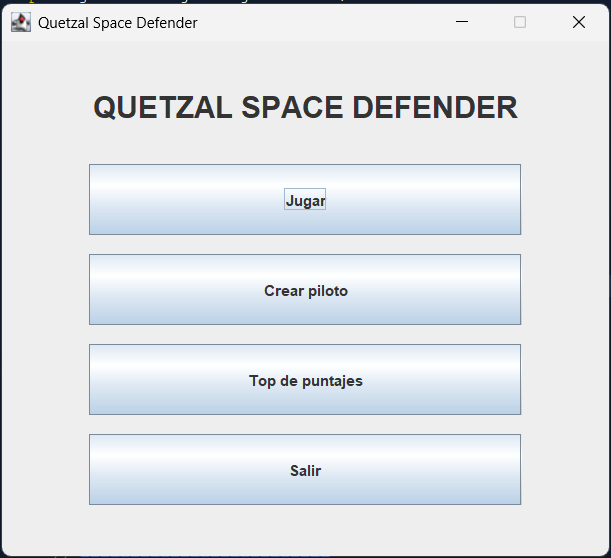
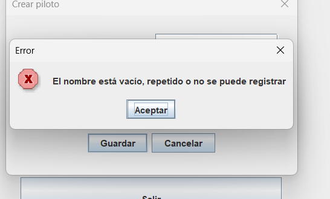

# Manual de usuario — Quetzal Space Defender

**Práctica 2 · Introducción a la Programación y Computación 1**  
**Estudiante:** René Fuentes · **Carné:** 202501994

## ¿Qué es?

Quetzal Space Defender es un juego sencillo de naves. Registra un piloto, escoge una nave, esquiva a los enemigos y recoge objetos para conseguir puntos. La partida termina al perder las tres vidas.

## 1. Abrir el programa

Abre el proyecto Maven de la carpeta `Practica2` en NetBeans y ejecútalo. Aparecerá un menú con **Jugar**, **Crear piloto**, **Top de puntajes** y **Salir**.



Si aún no hay pilotos registrados, empieza por **Crear piloto**.

## 2. Crear un piloto

Escribe un nombre y selecciona una de las tres naves en el desplegable. Después presiona **Guardar**.


| Nave | Cómo se siente al jugar | Recarga del disparo |
| --- | --- | --- |
| Explorador | Se mueve rápido | 2 segundos |
| Caza Estelar | Velocidad intermedia | 1 segundo |
| Acorazado | Se mueve lento | 0.3 segundos |

Si el nombre está vacío, ya existe o no se puede registrar, aparece un aviso. Presiona **Aceptar** y corrige el nombre.



## 3. Seleccionar piloto e iniciar

En el menú, presiona **Jugar**, abre la lista y elige el piloto con el que quieres entrar. Después pulsa **Comenzar**.


## 4. Controles y objetivo

| Acción | Teclas |
| --- | --- |
| Subir | `W` o flecha arriba |
| Bajar | `S` o flecha abajo |
| Ir a la izquierda | `A` o flecha izquierda |
| Ir a la derecha | `D` o flecha derecha |
| Disparar | Barra espaciadora |

Puedes mantener presionadas dos direcciones para moverte en diagonal. Para disparar otra vez, suelta y vuelve a pulsar espacio cuando haya terminado la recarga de tu nave; mantenerlo presionado no dispara continuamente.

Los enemigos rojos llegan desde el lado derecho. Dispárales o esquívalos: cuando tocan tu nave pierdes una vida. La parte superior muestra el puntaje y las vidas que quedan. Tienes **tres vidas**.


### Objetos especiales

| Apariencia | Objeto | Resultado |
| --- | --- | --- |
| Cuadrado azul | Quaffle | Ganas 10 puntos |
| Círculo amarillo | Snitch | Ganas 150 puntos y desaparecen los enemigos visibles |
| Círculo gris | Bludger | La nave queda inmóvil durante 2 segundos |

El Snitch sale pocas veces. **Eliminar enemigos no da puntos**; recoge Quaffles y Snitches para subir el marcador.

## 5. Final de la partida

Al perder la última vida, aparece una ventana con el nombre del piloto y el puntaje final. Pulsa **Aceptar** para regresar al menú.


La partida se agrega al historial al terminar por pérdida de vidas. Si cierras manualmente la ventana antes de eso, no esperes que se registre como partida terminada.

## 6. Consultar resultados

En el menú principal, presiona **Top de puntajes**. Se abre una ventana con dos pestañas:

- **Top de Puntajes:** muestra todas las partidas, ordenadas de mayor a menor. Abajo hay una gráfica con hasta diez de los mejores resultados
- **Historial:** muestra todas las partidas en el orden en que se jugaron


Un mismo piloto puede aparecer varias veces si jugó varias partidas.

## 7. Generar el reporte

En la ventana de resultados, haz clic en **Generar reporte**. El programa crea un archivo HTML con el historial y una imagen de la gráfica; intenta abrir el reporte en el navegador.


Los archivos se guardan en la carpeta `reportes/`:

```text
reportes/
├── reporte_partidas.html
└── grafica_puntajes.png
```

Mantén esos dos archivos en la misma carpeta para que la imagen aparezca dentro del reporte. Si necesitas una copia en PDF, abre el HTML en el navegador, presiona `Ctrl + P` y selecciona **Guardar como PDF**.

## Notas útiles

- Los pilotos y las partidas permanecen disponibles mientras la aplicación está abierta; al cerrarla, esos datos no se recuperan automáticamente
- El reporte HTML sí queda como archivo. Si vuelves a generarlo, se actualizan los archivos del reporte, así que guarda una copia si deseas conservar una versión anterior
- Si las teclas no responden, haz clic dentro de la ventana del juego para darle el foco
- Si la gráfica del HTML no aparece, revisa que `grafica_puntajes.png` esté junto a `reporte_partidas.html`
